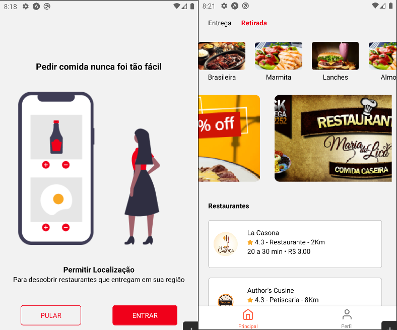

# IFOOD CLONE 

<p align="center"><a href="https://www.dio.me/">
  </a>
  </p>
  
Aplicativo criado no curso de react native da digital innovation one

  <!--ts-->
- [IFOOD CLONE](#ifood-clone)
  - [ℹ️ About](#ℹ️-about)
  - [⁉️ Motivation](#️-motivation)
  - [🌱 Minimum Requirements](#-minimum-requirements)
  - [🚀 Technologies Used](#-technologies-used)
  - [🔗 How to run](#-how-to-run)
    - [EndPoints](#endpoints)
  - [📝 License](#-license)
  <!--te-->

<p align="center">

</p>

## ℹ️ About

A aplicação consiste em um clone do ifood para celulares feito em React Native, Expo e React Navigation.

Seguindo as orientações do professor da DIO, Pablo Henrique ([@pablohdev](https://github.com/pablohev)).

## ⁉️ Motivation

The *Criando a interface do iFood com React Native* course is part of *#[DIO's MRV Bootcamp.](https://web.dio.me/track/mrv-fullstack-developer)*, a partnership between [Digital Innovation One](https ://github.com/digitalinnovationone), [Orbi Conecta](https://github.com/orbiconecta) and #MRV&CO.

## 🌱 Minimum Requirements

[](https://npmjs.com/package/express)

[](https://yarnpkg.com/package/express)

## 🚀 Technologies Used

The project was developed using the following technologies:

- JavaScript
- React Native
- React-navigation
- expo
- Styled-components

## 🔗 How to run

To copy the project, use the commands:

```bash
  # Clone the repository
  ❯ git clone https://github.com/luandiasrj/app-ifood-clone-master.git
  # Enter the directory
  ❯ cd app-ifood-clone-master
```


To install the dependencies and start the project:


**Using Node.JS**

```bash
  # Install dependencies
  ❯ npm install
  ❯ npm install --global yarn
  ❯ yarn add --dev yarn-upgrade-all
  ❯ npx yarn-upgrade-all
  # Start the project
  ❯ yarn start
```

### EndPoints

<p>Para consumir dados usamos uma api fake, usando os seguintes endpoints<p>

| NOME         | ENDPOINT                                                                      |
| ------------ | ----------------------------------------------------------------------------- |
| GERAL        | http://my-json-server.typicode.com/pablohdev/app-ifood-clone/db               |
| BANNERS      | http://my-json-server.typicode.com/pablohdev/app-ifood-clone/banner_principal |
| CATEGORIAS   | http://my-json-server.typicode.com/pablohdev/app-ifood-clone/categorias       |
| RESTAURANTES | http://my-json-server.typicode.com/pablohdev/app-ifood-clone/restaurantes     |


## 📝 License

This project is licensed under the MIT License - see the [LICENSE.md](LICENSE) file for details
  
</p>

* * *
<h4 align="center">
  Made with ❤️ by luandiasrj 👋️ <a href="mailto:luandias@outlook.com">Get in touch!</a>
</h4>

<p align="center">
  
<a href="https://www.linkedin.com/in/luan-bernardo-dias"/>
</a>

<a href="https://www.instagram.com/luandiasrj/"/>
</a>
  
</p> 


